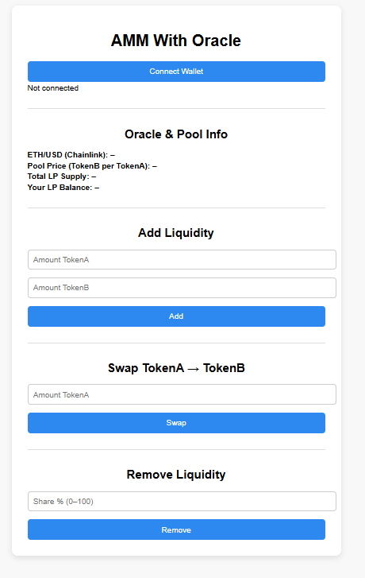

# TokenMarket 🧮

**TokenMarket** is a full-stack Web3 project featuring a decentralized Automated Market Maker (AMM) with Oracle integration, LP token logic, and live ETH/USD pricing via Chainlink. Inspired by Uniswap V2, it supports token swaps, liquidity provision, fee mechanics, and a functional front-end for user interaction.

Built in just a few days as the second milestone of my Solidity learning journey (after NeoGuilder), TokenMarket is modular, auditable, testable, and deployable on Sepolia.

---

## 🚀 Features

✅ **Uniswap V2–Style AMM**  
- Supports swaps between TokenA and TokenB  
- Constant product formula (x * y = k)  
- 0.3% fee on each swap

✅ **Chainlink Oracle Integration**  
- Live ETH/USD pricing from Chainlink (testnet)  
- Useful for real-time price display and future use cases

✅ **LP Token Support**  
- Custom ERC-20 LP token (`LPToken`)  
- Minted when adding liquidity, burned on withdrawal  
- Allows proportional ownership & tracking

✅ **Frontend (Ethers.js)**  
- Connect wallet (MetaMask)  
- Swap TokenA → TokenB  
- Add/remove liquidity  
- Real-time oracle & pool price display  
- LP balance and total supply display

✅ **Unit Tests (Hardhat + Chai)**  
- Swap logic  
- Liquidity logic  
- Oracle reading  
- LP mint/burn tracking

✅ **Full Deployment System**  
- `deploy.js` (contracts deployment)  
- `seed.js` (initial liquidity injection)  
- Clean `deployed.json` config  
- Modular ABI usage

---

## 📦 Installation & Setup

### 1️⃣ Prerequisites

Make sure you have the following installed:

- Node.js  
- MetaMask  
- Hardhat

### 2️⃣ Clone the Repository

git clone https://github.com/DenoyelSeb/TokenMarket.git
cd TokenMarket

### 3️⃣ Install Dependencies

npm install

Used dependencies:
ethers
hardhat
@openzeppelin/contracts
dotenv

### 4️⃣ Compile & Deploy to Sepolia

npx hardhat compile

npx hardhat run scripts/deploy.js --network sepolia

To seed liquidity:
npx hardhat run scripts/seed.js --network sepolia

🔗 Contract Addresses

Stored in deployed.json after deployment:
TokenA: [TOKEN_A_ADDRESS]
TokenB: [TOKEN_B_ADDRESS]
LPToken: [LP_TOKEN_ADDRESS]
MockOracle: [MOCK_ORACLE_ADDRESS]
AMMWithOracle: [AMM_ADDRESS]

🧪 Run Unit Tests

npx hardhat test

🌐 Frontend Usage

The project includes a complete frontend built with vanilla HTML + Ethers.js.

To use it:

Open index.html in your browser

Connect MetaMask to Sepolia

Use the interface to:
🔄 Swap TokenA → TokenB
➕ Add liquidity
➖ Remove liquidity
📈 View pool price & oracle price
💰 Track your LP token balance

🖼️ Example Interface

🧩 Smart Contract Modules

| Contract            | Description                                     |
| ------------------- | ----------------------------------------------- |
| `TokenA.sol`        | ERC-20 base token                               |
| `TokenB.sol`        | Second ERC-20 token                             |
| `MockOracle.sol`    | Mock ETH/USD oracle for testing                 |
| `LPToken.sol`       | ERC-20 token representing LP ownership          |
| `AMMWithOracle.sol` | Core AMM contract with swap, add/remove, oracle |

🤝 Contribution
This is a personal project built for skill demonstration and portfolio purposes.
Feel free to fork, explore, or reach out for collaboration.

⚖️ License
MIT License. Free to use, modify, and distribute.

📢 Notes
This project is a full technical showcase of an AMM system built from scratch — including swap mechanics, LP token issuance, oracle usage, and frontend integration — in a concise and understandable way.

I built it solo, in just a few days, to complement the architecture of NeoGuilder and prove readiness for real-world Solidity roles.

🚀 Happy Building — and welcome to the world of Web3.

